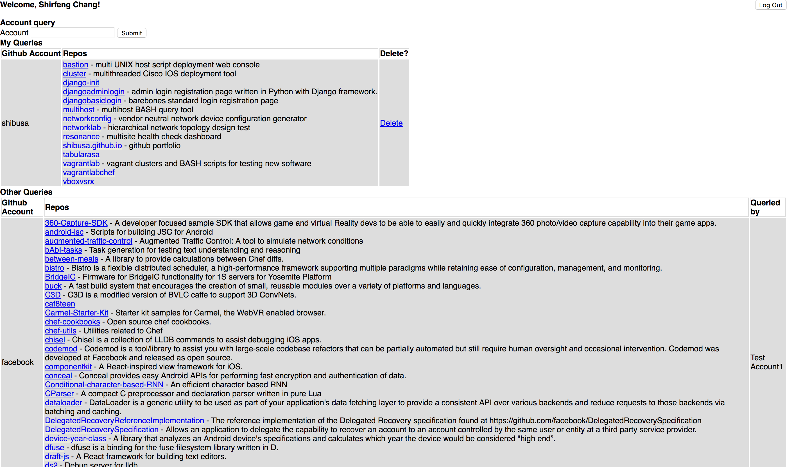

# GitHub Query

GitHub user repo query dashboard written in Python with Django framework.  Uses requests library to obtain head response, then collect data from GitHub API for user/repo information.

### Requirements:
- Django 1.11.3
- [Supported Python version](https://docs.djangoproject.com/en/1.11/faq/install/#faq-python-version-support)

### Demo Purposes:
1. Install dependencies found in 'requirements.txt'
```
pip install -r requirements.txt
```
2. Make migrations
```
./manage.py makemigrations
./manage.py migrate
./manage.py loaddata init.json
```
3. Start server
```
./manage.py runserver
```
4. Login with
```
account: admin
password: password
```

### Installation:
1. Install dependencies found in 'requirements.txt'
```
pip install requirements.txt
```
2. Move login app to your base project folder housing manage.py and sub project folder
3. Add app to 'INSTALLED_APPS = []' section of {sub project folder}/settings.py
4. Adjust routes accordingly in {sub project folder}/urls.py
5. Adjust paths accordingly in login/views.py
6. Adjust paths accordingly in login/templates/login/{htmlpage}.html
